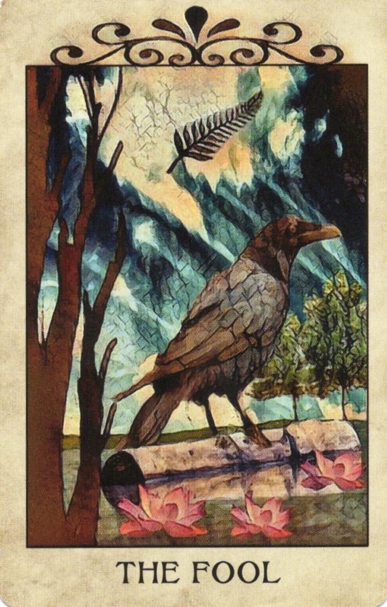
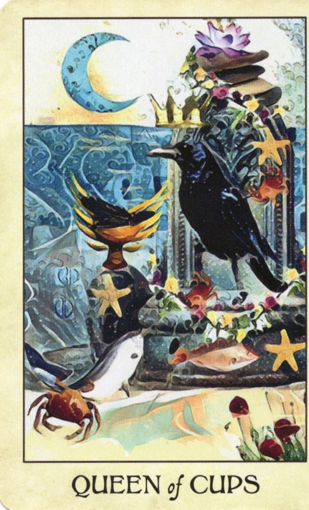
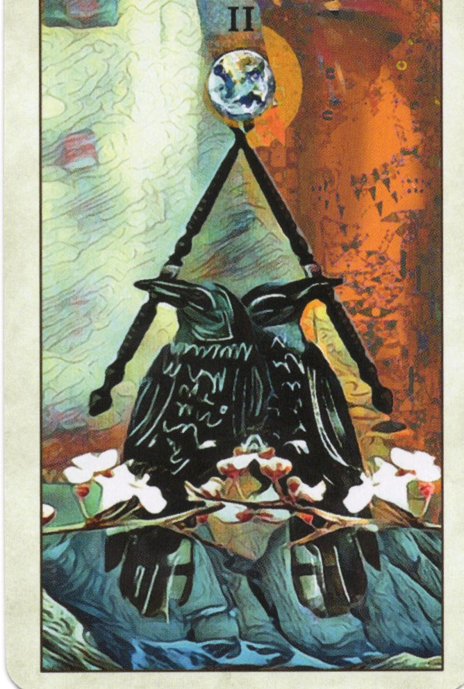
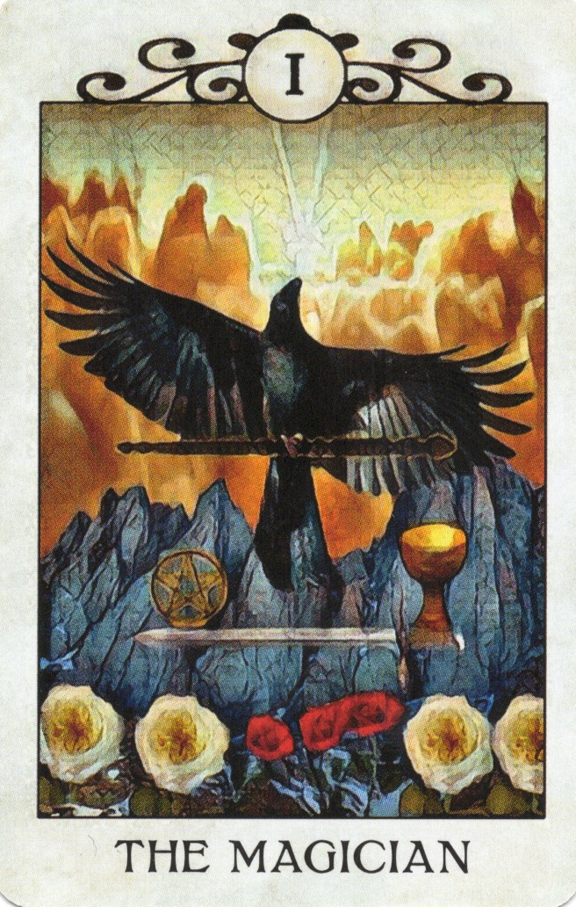
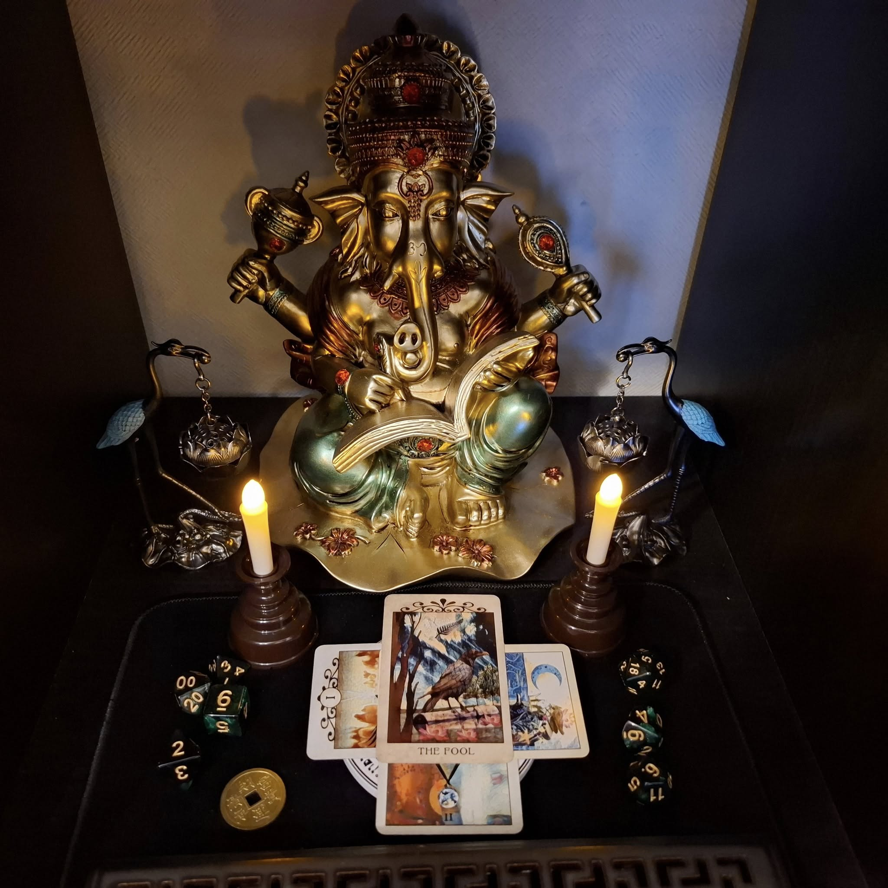

# Ganesha Kumano Ritual

This ritual is designed for the journey to Kumano Sanzan (three grand shrines of Kumano), invoking the blessings of Ganesha and integrating Western ceremonial magic (symbolized through the Crow Tarot).

---

## 🪷 Ritual Structure

1. **Chant "Om Gam Ganapataye Namaha" × 3**
2. **Invocation / Petition**: Ask Ganesha for blessings and protection for the journey.
3. **Present the cards and intent**
4. **Seal with IAOM**
5. **Chant "Om Gam Ganapataye Namaha" × 3**

---

## 🃏 Cards and Symbolism

| Position | Role (Theme)       | Card               | Symbolism                                                                 |
|----------|--------------------|--------------------|---------------------------------------------------------------------------|
| 1        | Target (Purpose)    | The Fool           | Pure-hearted departure, humility before Kumano deities, openness to unknown |
| 2        | Petition (Permission) | Queen of Cups      | Goddess / Hekate / Western rituals, approaching with reverence            |
| 3        | Progress (Integration) | Two of Wands     | Dialogue & collaboration between Western magic and Japanese kami          |
| 4        | Outcome (Growth)    | The Magician       | Presenting oneself as a magician, empowered by the ritual                 |

  
  
  
  

---

## 🔻 Card Layout: Windmill Formation (Right-Rotation)

Instead of the traditional triangle + center layout, the cards are placed in a **windmill-like spiral formation**, rotating clockwise from the top. This format:

- **Highlights the main intention (Card 1)** at the top
- **Allows subtle presence** of the other 3 cards
- **Saves altar space**, suitable for modern environments
- **Helps confirm the memorized intent** without distraction
- Acts as a **symbolic mirror** of mental alignment and commitment

> This layout invites the magician to carry the full ritual narrative in memory, reinforcing clarity of purpose.
- Card 1: The purpose of the journey (The Fool)
- Card 2: Seeking permission (Queen of Cups)
- Card 3: Integration path (Two of Wands)
- Card 4: Outcome and transformation (The Magician)

---

## 🧰 Tools

- Altar or quiet focused space
- Crow Tarot deck
- Incense (optional)
- Candle (optional)

---

## 📜 Notes

This ritual remains intentionally in English to maintain symbolic clarity and avoid misinterpretation. It is a private ritual but may be shared with trusted practitioners.

© 2025 ravensgate-tux / Creative Commons Attribution 4.0 International (CC BY 4.0)
